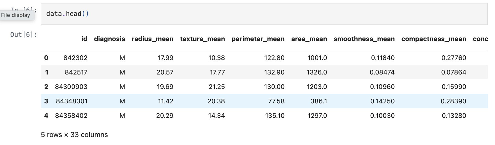
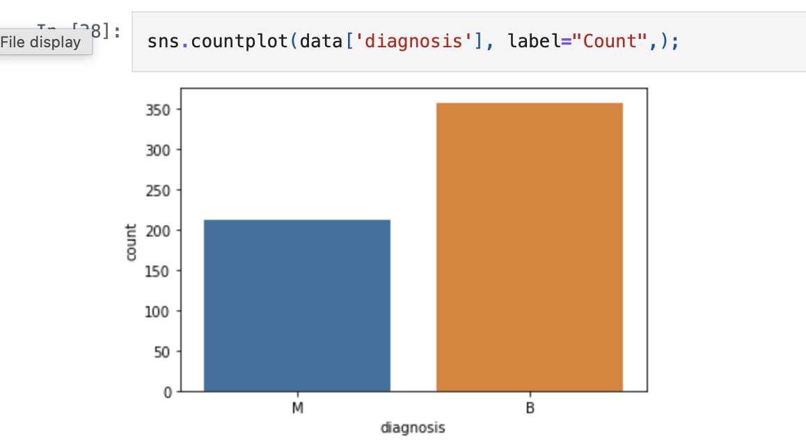
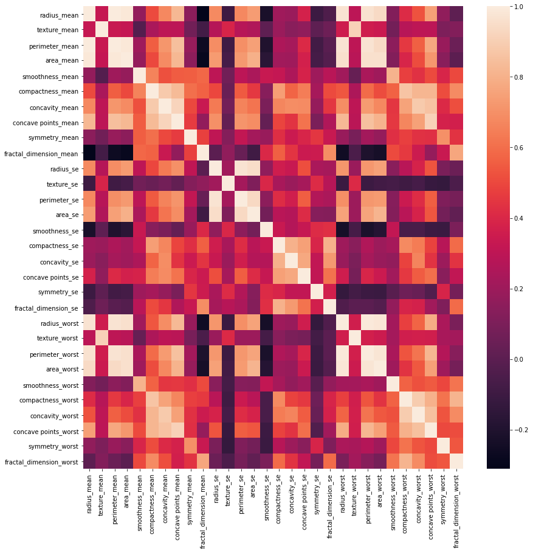
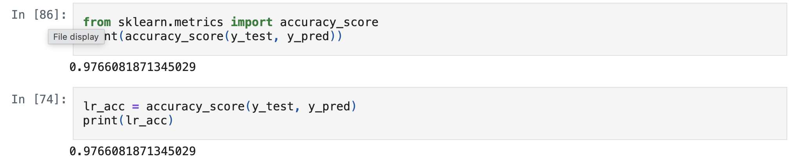

# Breast Cancer Prediction using Machine Learning

---

## Overview

This project predicts whether a breast tumor is **Malignant** or **Benign** using multiple machine learning classification models.
It demonstrates an end-to-end ML pipeline including preprocessing, model training, and evaluation.

---

## Dataset

* **Breast Cancer Wisconsin (Diagnostic) Dataset**
* **Samples:** 569
* **Features:** 30 numerical features
* **Target:** Malignant (M) / Benign (B)

---

## Tech Stack

* Python
* NumPy, Pandas
* Matplotlib, Seaborn
* Scikit-learn

---

## Models Used

* Logistic Regression
* Decision Tree
* Random Forest
* SVM
* KNN
* Naive Bayes

---

## Evaluation

* Models compared using **Accuracy Score**

---

## Screenshots

### Dataset Preview

### Class Distribution

### Correlation Heatmap

### Model Accuracy Output

### Model Accuracy Comparison

---

## Outcome

Multiple machine learning models were trained and evaluated to identify the most accurate approach for breast cancer prediction.

---
